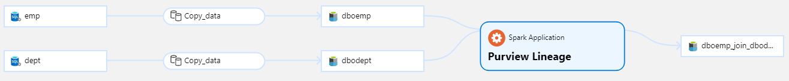

# Integrate Databricks Lineage In Azure Purview

## Description
The is a repository containing the necessary code to track data lineage from Databricks in Azure Purview. An example can be seen below:




We use the [Spline](https://absaoss.github.io/spline/) module to harvest the Spark executions. We then send the Spline generated data to an Azure Function which stores and converts the data to a format that the [Apache Atlas API](https://atlas.apache.org/#/) can read. We can then send this data to an Azure Purview account to track our data lineage. It is illustrated below: 


The code can track lineage for data stored in Azure Data Lake gen 2, but it can easily be adapted to other storage types.

Note that Azure Purview is in Public Preview. The code here could therefore be deprecated quite soon or better solution will be made. 

## Setup
The setup requires an Azure Account and some knowledge of different Azure Services. To use it you need to deploy the API Converter to an Azure Function and afterwards run the Spark initialization script. 

The services used are: 
 * Azure Functions 
 * Azure Databricks 
 * Azure Blob Storage 
 * Azure Purview

To deploy the Azure function you must set the environments variable in the Function to point to your Azure Purview service principal and Azure Blob Storage. 

To use the Spark Initialization script you need to point the API to your Azure Function. 

A full guide how to set it up can be found here: [Intellishore Guide To Data Lineage](https://intellishore.dk)

## Usage
Run the Spark Lineage Harvester in the beginning of your Databricks notebook. 
```python
%run "Spark Lineage Harvest Init"
```
## Contributing
Pull requests are very welcome. For major changes, please open an issue first to discuss what you would like to change.

Please make sure to update tests as appropriate.

## License
[MIT](https://choosealicense.com/licenses/mit/)